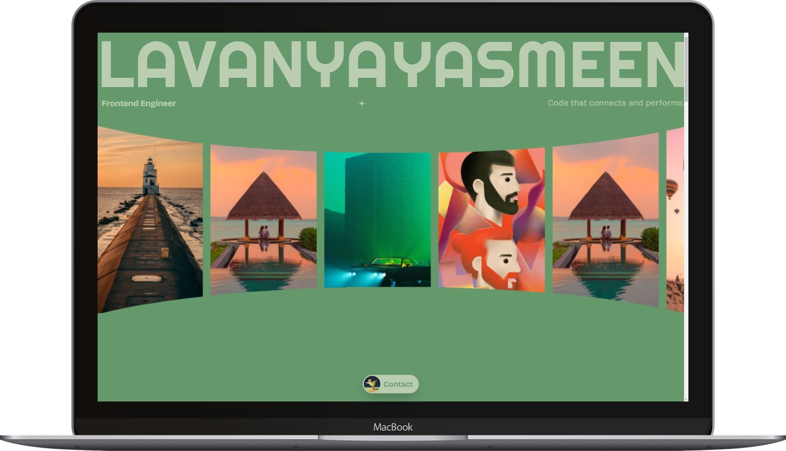

# Lavanya Portfolio (Jazzicreates Clone)


_Homepage showcase of the Jazzicreates Clone project_

[](https://lavanyaportfolio-web.vercel.app)
[](https://github.com/mkhoirulwafa18/lavanyaportfolio)

A faithful recreation of [jazzicreates.tv](https://jazzicreates.tv) showcasing modern web animation techniques and interactive design patterns.

## 📋 Disclaimer

This project is a clone of [jazzicreates.tv](https://jazzicreates.tv) created for **educational purposes only**. All original designs, animations, and creative concepts belong to the talented developer behind jazzicreates.tv. This implementation serves as a learning exercise in advanced web animation techniques.

## 🌟 Live Preview

Experience the clone at:  
**https://lavanyaportfolio-web.vercel.app**

## ✨ Features

- **Pixel-perfect Recreation**: Faithfully replicates the original site's animations and interactions
- **Advanced Animations**: GSAP-powered timeline animations with ScrollTrigger
- **Physics-based Interactions**: Matter.js integration for realistic physics simulations
- **Responsive Design**: Flawless experience across all device sizes
- **Performance Optimized**: Efficient animation rendering and smooth scrolling
- **Modern Development Stack**: Next.js 15 with TypeScript and TailwindCSS

## 🛠 Tech Stack

- **Framework**: Next.js 15 (App Router)
- **Language**: TypeScript
- **Styling**: TailwindCSS
- **Animations**: GSAP + ScrollTrigger + SplitText
- **Physics**: Matter.js
- **Package Manager**: Bun (npm/yarn compatible)
- **Deployment**: Vercel

## 🎬 Animation System

The project implements a sophisticated animation system featuring:

- Timeline-based scroll-triggered animations
- Line-by-line text reveals using SplitText
- Custom cursor interactions
- Physics-based element movements
- Smooth page transitions
- Parallax scrolling effects

## 🚀 Getting Started

### Prerequisites

- Node.js 18.17 or later
- Bun (recommended) or npm/yarn

### Installation

1. Clone the repository:

```bash
git clone https://github.com/mkhoirulwafa18/lavanyaportfolio.git
cd lavanyaportfolio
```

2. Install dependencies:

```bash
bun install
```

3. Start the development server:

```bash
bun dev
```

4. Open http://localhost:3000 in your browser

### Building for Production

```bash
bun build
```

## 📁 Project Structure

```text
jazzicreates-clone/
├── apps/
│ └── web/ # Next.js application
│ ├── src/
│ │ ├── app/ # Next.js app router pages
│ │ ├── components/ # Reusable React components
│ │ ├── sections/ # Page section components
│ │ ├── lib/ # Utilities & constants
│ │ └── hooks/ # Custom React hooks
│ ├── public/ # Static assets
│ └── styles/ # Global styles
├── package.json
└── README.md
```

## 📜 Available Scripts

- `bun dev` - Start development server

- `bun build` - Build for production

- `bun start` - Start production server

- `bun lint` - Run ESLint

- `bun check-types` - Validate TypeScript types

## 🧪 Development Notes

- Components are organized by functionality and section

- Animation logic is abstracted into custom hooks for reusability

- GSAP contexts are properly cleaned up to prevent memory leaks

- Responsive breakpoints follow Tailwind's mobile-first approach

## 🤝 Contributing

While this is primarily an educational project, suggestions and improvements are welcome. Please ensure that any contributions respect the original creator's work and adhere to the educational purpose of this clone.

## 📄 License

This project is created for educational purposes only. All rights to the original design and concept belong to the creator of jazzicreates.tv.

---

_This project demonstrates advanced web animation techniques and serves as a learning resource for developers interested in interactive web experiences._
